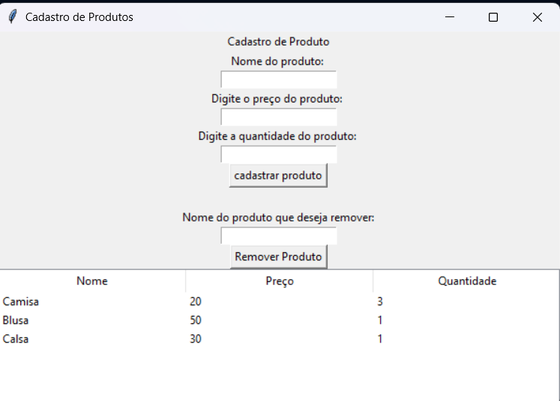
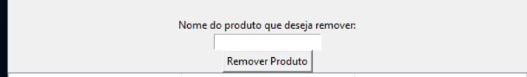

# Gerenciador De Estoque
---
## Explicação sobre o meu projeto

Nesse projeto tem dois arquivos logica_produtos.py e interfase.py na logica_produtos.py ela é cabeça
do projeto, onde tem cadastro de produtos, remover produto, lista de produto já cadastrado. Nisso eu
fiz esse arquivo com base nos meus estudos e com os meus conhecimentos, já a interfase.py eu fiz com
ajuda do chatgpt, queria algo visual e simples onde eu poderia aprender.

## Oque o meu projeto faz?

No gerenciador de projetos, ele já vem com três produtos cadastrado inicialmente sendo camisa, blusa e
calsa, onde ele fica em uma tabela com os nomes preço e quantidade de produto desejado.
No meu porjeto pode cadastrar o nome do projeto, preço e a quantidade, e a função de remover produto.

## Tela do Projeto

    

## Cadastro de Produto

    

    <em>Tela responsável pelo cadastro de novos produtos.</em>

## Explicação

Na imagem acima, é a parte de cadastro de produtos, onde vc digita o nome do produto, preço e
qauntidade.
Como eu fiz pra adicionar o produto? na parte do nome tem uma variavel que recebe o nome digitado,
a mesma coisa com preço e quantidade, essas variavel eu coloco em um dicionario novo e adiciono na
lista, para adicionar um novo produto.

## Remover produto

## 🗑️ Remover Produto

    

    <em>Tela utilizada para remover produtos cadastrados.</em>

## Explicação